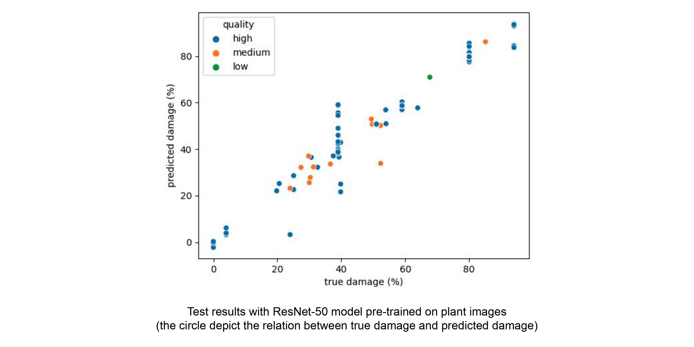
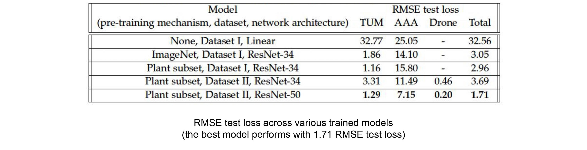

# Sugar Beet Leaf Damage Regression Model for Smart Plant Monitoring

<p align="center"></p>

## Introduction
We propose a computer vision and deep learning-based method of detecting sugar beet 
leaf damage rates using a convolutional neural network that can be incorporated into 
a smartphone application. We adopt a transfer learning mechanism by pre-training the 
model on plant-related images for plant classification task to improve the performance 
of the damage regression model. We visualize the learned features of our trained model
to see how it recognizes the pattern of the damaged sugar beets. Our trained model 
achieves a RMSE of 1.71 on our held-out test set, hence demonstrating the feasibility 
of a deep learning-based approach. Our work can play an important role in providing a 
clear path toward automated and efficient crop damage detection system which can bring 
lots of benefits to both farmers and agriculture insurers.

## Setup
Create conda environment with packages to be installed. 
```shell
conda env create --file=idp_yoonha.yaml
```

## Usage
### Pre-training
To pre-train the plant classification model:
```shell
python pretrain_plant.py --epochs NUM_OF_EPOCHS
```

### Training
To train the damage regression model:
```shell
python train_regression.py --epochs NUME_OF_EPOCHS
```
### Linear model fitting
To fit the linear damage regression model:
```shell
python linear_generate_training_test.py
python linear_fitting.py
```

### Evaluation
To evaluate the trained damage regression model:
```shell
python test_regression.py
```
To evaluate the linear damage regression model:
```shell
python test_linear.py
```
To visualize the learned feature map of damage regression model:
```shell
python featurevisualizer.py
```
<p align="center"></p>
<p align="center"></p>
